# crispy

## Introduction

## Architecture

In this architecture, we have several microservices working together to provide a complete solution for the use case you defined:

- The Scraping Microservice is responsible for making HTTP requests to the technical news websites, scraping the data from the responses, and returning the raw text to the Natural Language Processing Microservice.

- The Natural Language Processing Microservice is responsible for processing the raw text using a summarization model to create summaries of the news. It returns the summaries to the API Gateway Microservice which is responsible for serving those summaries through an API.

- The Audio Streaming Microservice is responsible for generating audio files for the summaries using a text-to-speech model. It receives text from the Natural Language Processing Microservice and returns audio files to the Audio Clients.

- Finally, the API Gateway Microservice is responsible for serving the summaries through an API to the API Clients.

Overall, this architecture allows for efficient and scalable processing of the technical news data, summarization, and text-to-speech generation, with separate microservices handling each task.

## DFD Diagram

## Sequence Diagram of Scraper Service

```mermaid
sequenceDiagram
    participant TechnicalNewsWebsites
    participant ScrapingMicroservice
    participant ScrapingDB
    participant RabbitMQ
    participant SummarizationService
    
    TechnicalNewsWebsites->>ScrapingMicroservice: HTTP Request
    activate ScrapingMicroservice
    ScrapingMicroservice->>RabbitMQ: Send scraped data
    activate RabbitMQ
    RabbitMQ->>SummarizationService: Receive scraped data
    activate SummarizationService
    deactivate SummarizationService
    deactivate RabbitMQ
    ScrapingMicroservice->>ScrapingDB: Store scraped data
    ScrapingMicroservice->>ScrapingMicroservice: Return response
    deactivate ScrapingMicroservice
    ScrapingDB-->>ScrapingMicroservice: Success response
```

This sequence diagram shows the interactions between the Technical News Websites, the Scraping Microservice, RabbitMQ, the Natural Language Processing Microservice, and the Scraping DB.

- The Technical News Websites send an HTTP Request to the Scraping Microservice. The Scraping Microservice then sends the scraped data to the RabbitMQ node on the scraped_data topic. The Natural Language Processing Microservice receives the scraped data from the RabbitMQ node on the scraped_data topic.

- The Scraping stores the scraped data in the Scraping DB, and returns a success response.

This sequence diagram shows the asynchronous nature of the system, where data flows through the message broker instead of being passed directly between the services. It also highlights the use of APIs to enable communication between the microservices and external systems.

---

## Class Diagram of Scraper Service

In this class diagram, we have three pipelines that inherit from the Spider abstract class. The Spider class contains two methods: start_requests() and parse(response), which are used to initiate requests to the website and parse the responses respectively.

The ItemPipeline is responsible for processing the items returned by the spider. This could involve cleaning and validating the data or simply passing it on to other pipelines.

The DatabasePipeline is responsible for storing the data in a database. It has three methods: __init__(db_url), open_spider(spider), and close_spider(spider) which are used to initialize the database connection, open and close the connection before and after the spider runs, respectively, and process_item(item, spider) which is used to insert the item into the database.

The MessageQueuePipeline is responsible for pushing the data to a message queue. It has three methods similar to DatabasePipeline: __init__(mq_url), open_spider(spider), close_spider(spider) and process_item(item, spider). These methods are used to initialize the message queue connection, open and close the connection before and after the spider runs, respectively, and push the item into the message queue.

Overall, this class diagram shows the basic structure of a web scraping process using scrapy and how the data can be processed and stored in different ways.

---

## Flowchart of Scraper Service

In this DFD diagram, the website is the source of the data and requests are sent to it by the spider. The spider then extracts items from the website's responses and sends them to the item pipeline for processing.

Once the items have been processed, they are sent to both the database and the message queue for storage and further use. The database pipeline is responsible for storing the data in a database, while the message queue pipeline is responsible for pushing the data to a message queue.

Overall, this DFD diagram shows the flow of data in a web scraping process using scrapy and how the data can be stored in different ways.

## Class Diagram of RabbitMQ Broker

- The Message class is the base class for all messages in each topic. It contains a dictionary of data and has methods to serialize and deserialize the data.

- The ArticleMessage, SummaryMessage, and AudioMessage classes are subclasses of Message and represent messages for the article, summary, and audio topics, respectively. These classes contain the relevant data for each message type.

- The RabbitMQPublisher class is responsible for publishing messages to RabbitMQ. It has a publish_message method that takes a queue name and a Message object as inputs, and publishes the message to RabbitMQ.

- The RabbitMQListener class is responsible for listening to messages on RabbitMQ. It has a listen_for_messages method that takes a queue name and a callback function as inputs, and listens for messages on the queue. When a message is received, the callback function is called with the deserialized message as input.

Note that the RabbitMQPublisher and RabbitMQListener classes are implementation details that are not specific to any particular microservice, but are used by multiple microservices in the overall architecture.

The diagram shows that the ArticleMessage, SummaryMessage, and AudioMessage classes inherit from the Message class. It also shows that the RabbitMQPublisher and RabbitMQListener classes use the Message class in their methods.

The arrow between RabbitMQPublisher and Message indicates that the RabbitMQPublisher class uses the Message class as an input parameter in its publish_message method. Similarly, the arrow between RabbitMQListener and Message indicates that the RabbitMQListener class receives a Message object as input in its listen_for_messages method.

## Class Diagram for Natural Language Processing Microservice

This class diagram shows the relationship between the different components of the Natural Language Processing Microservice.

The NLPService is an interface that defines the summarize method, which takes in a string of data and returns a list of summaries.

The NLPMicroservice class implements the NLPService interface and uses a MessageQueue to communicate with other microservices. It also contains references to a SummarizationModel and a TextToSpeechModel, which it uses to perform summarization and text-to-speech synthesis.

The RabbitMQ class provides a message queue interface for sending and receiving messages, which is used by the NLPMicroservice to communicate with other microservices.

The SummarizationModel class represents the summarization model used by the NLPMicroservice to generate summaries.

The TextToSpeechModel class represents the text-to-speech model used by the NLPMicroservice to generate audio files for the summaries.

Overall, this class diagram shows the components of the NLPMicroservice and their relationships with each other.

## Sequence Diagram for Natural Language Processing Microservice

This sequence diagram shows the flow of messages between the Scraping Microservice, RabbitMQ, Natural Language Processing Microservice, and Summaries DB. The Scraping Microservice sends scraped data to the RabbitMQ node on the scraped_data topic. The Natural Language Processing Microservice receives the scraped data from the RabbitMQ node on the scraped_data topic and stores the summaries in the Summaries DB. The Natural Language Processing Microservice then sends the summaries to the RabbitMQ node on the summaries topic.

This sequence diagram shows the asynchronous nature of the system, where messages are passed through the message broker instead of being sent directly between the microservices. It also shows how the Natural Language Processing Microservice interacts with the Summaries DB to store the summaries.

## Data Flow Diagram for Natural Language Processing Microservice

This DFD diagram shows the inputs, process, outputs and data stores for the Natural Language Processing Microservice. The microservice receives Raw Text from the Scraping Microservice as an input. It then processes the raw text using natural language processing algorithms to generate Summaries as an output. The Summaries are then stored in the Summaries DB.

This diagram illustrates how the Natural Language Processing Microservice fits into the larger system architecture, and shows the flow of data into and out of the microservice.

## Class Diagram for Text-to-Speech Microservice

